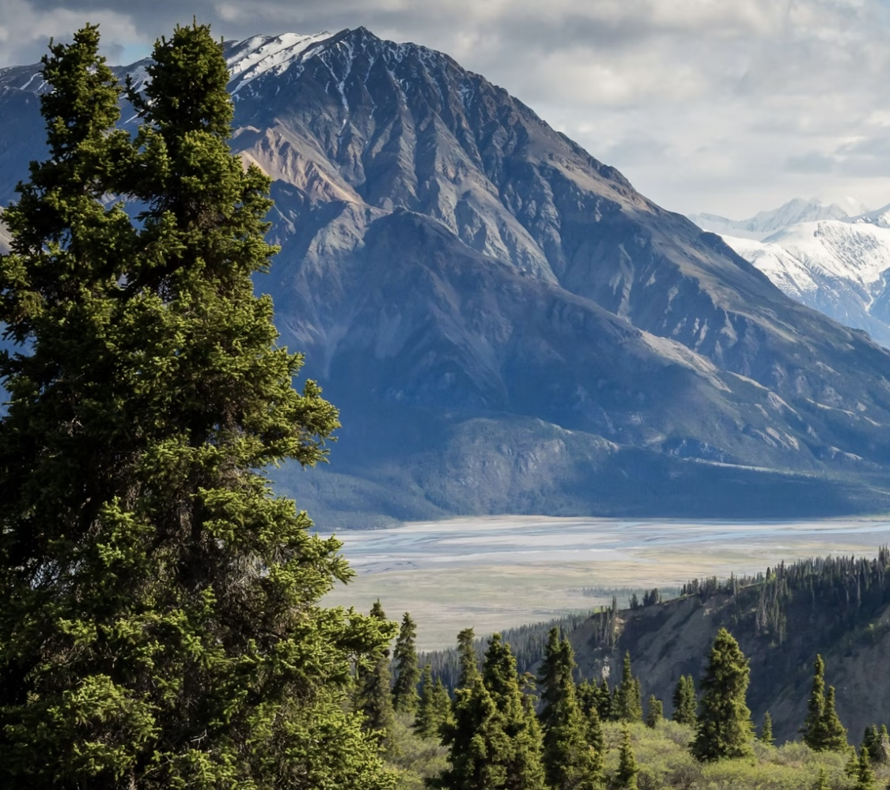
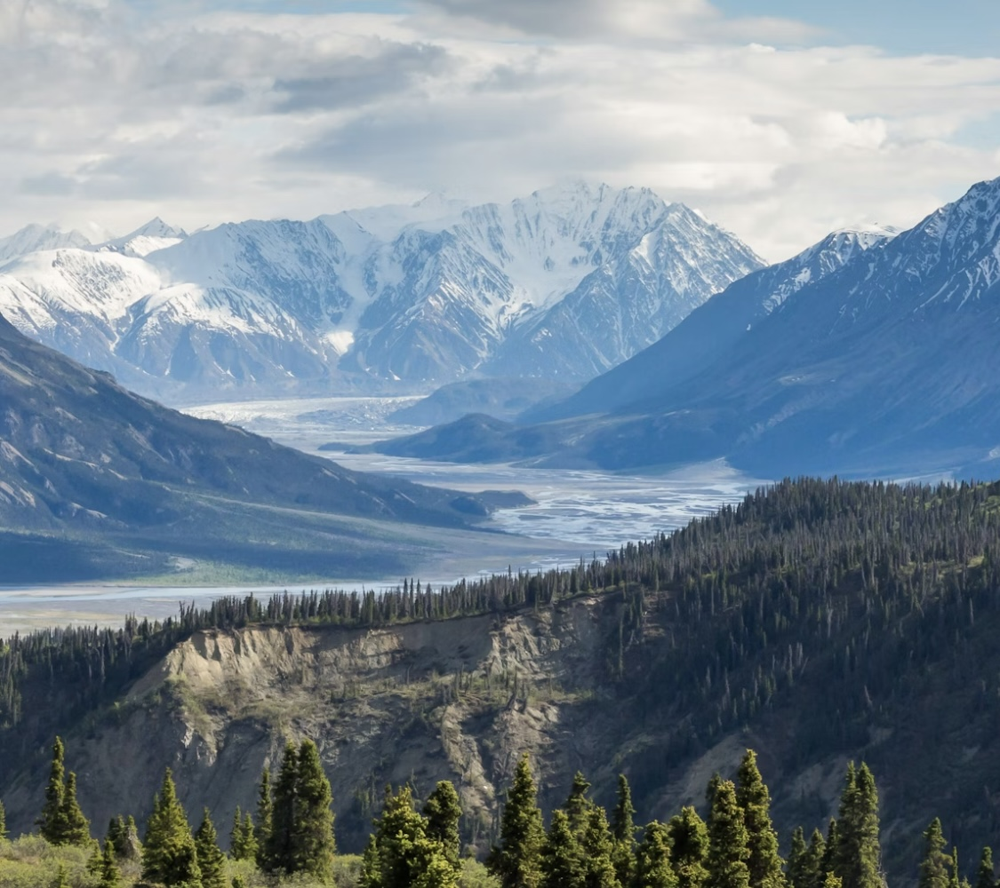
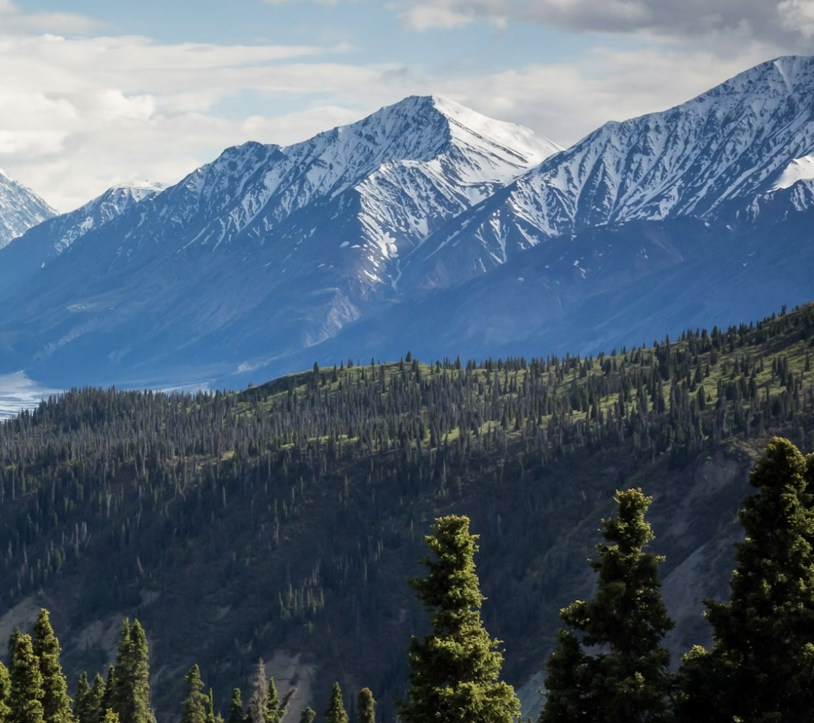
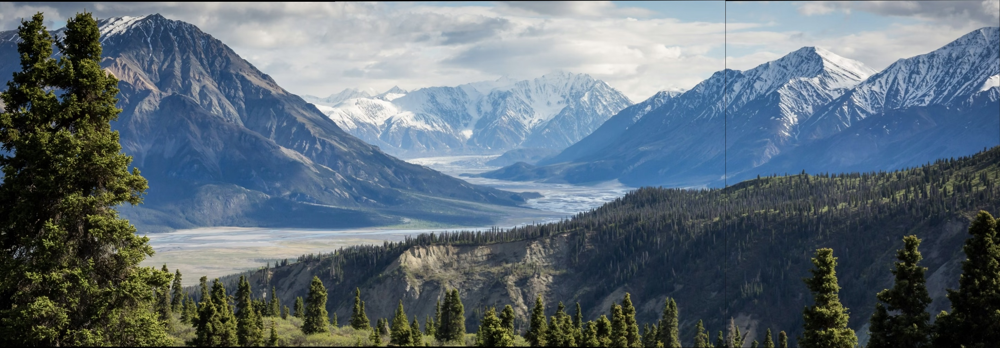

# 🏔️ Auto-Panorama-Stitcher

> **Description:** SIFT 특징점 매칭과 Homography 변환 알고리즘을 활용하여 여러 장의 이미지를 하나의 고해상도 파노라마로 합성하는 자동 이미지 정합 도구입니다.

---

## 🎯 프로젝트 개요

이 프로젝트는 풍경 사진이나 연속된 이미지 프레임을 분석하여 자연스러운 파노라마 이미지를 생성하는 것을 목적으로 합니다. 컴퓨터 비전의 고전적인 파이프라인인 특징점 추출, 매칭, 정합 과정을 직접 제어하도록 설계되었습니다.

## 🛠️ 주요 기능 (Key Features)

- **특징점 기반 정합:** SIFT(Scale-Invariant Feature Transform)를 사용하여 이미지의 크기나 회전 변화에 강인한 특징점을 추출합니다.
- **지능형 매칭:** FLANN 매처와 Lowe's Ratio Test를 결합하여 오매칭(Outlier)을 최소화하고 정밀한 대응 쌍을 찾습니다.
- **강력한 행렬 추정:** RANSAC 알고리즘을 적용하여 노이즈가 포함된 데이터에서도 정확한 Homography 행렬을 계산합니다.
- **심리스 블렌딩 (Seamless Blending):** 픽셀 가중치 합산 방식의 블렌딩을 적용하여 이미지 간의 경계선을 부드럽게 연결하고 조도 차이를 완화합니다.
- **자동 좌표 보정:** 워핑 과정에서 이미지가 잘리는 현상을 방지하기 위해 캔버스 크기를 동적으로 조절하고 좌표 오프셋을 계산합니다.

## 💻 기술 스택 (Technical Details)

- **Language:** Python
- **Library:** OpenCV (`cv2 as cv`), NumPy
- **Algorithm Pipeline:**
  1.  **Feature Detection:** SIFT Descriptor 추출
  2.  **Feature Matching:** KNN Matching & Outlier Filtering
  3.  **Geometry Estimation:** RANSAC-based Homography Matrix
  4.  **Perspective Warping:** Image Alignment & Translation
  5.  **Composition:** Multi-band Blending & Final Trimming

## 🖼️ 실행 결과 (Results)

이미지 정합 알고리즘을 통해 3장의 산악 지형 사진을 결합한 결과입니다.

### Input Data

|   Image 1 (Left)    |  Image 2 (Center)   |   Image 3 (Right)   |
| :-----------------: | :-----------------: | :-----------------: |
|  |  |  |

### Output Panorama



## 📂 실행 방법

1. 필수 라이브러리(`opencv-python`, `numpy`)를 설치합니다.
2. 정합할 이미지들을 프로젝트 루트 폴더에 위치시킵니다.
3. 아래 명령어를 통해 프로그램을 실행합니다.

```bash
python imageStitching.py
```
